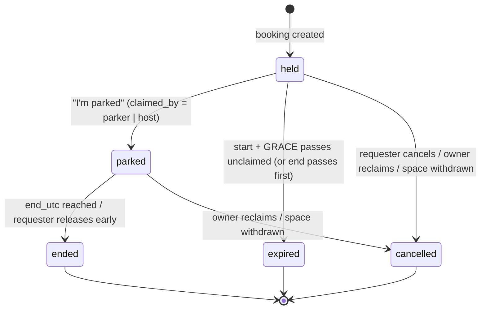

# Parking Manager: v1.0 Plan

A parking-sharing web app for one residential highrise (~100 apartments).

This document comes **before any code**. It covers the data model, the routes,
and the exception table. It also explains *why* each design choice was made.
Look for the **Why:** notes; they're written for someone new to building web apps.

> **Status (2026-09-17):** nothing is confirmed. The plain-language summary for
> the client is [PARKING_MANAGER_SUGGESTION.md](PARKING_MANAGER_SUGGESTION.md). "Suggestion N" below means its section N,
> where the reasoning and open questions for that topic live. This plan
> implements the current defaults, which may change when the client answers.
> §16 maps the summary's sections to this plan.

---

## Contents

1. [Principles](#1-principles)
2. [Architecture and stack](#2-architecture-and-stack)
3. [Time handling](#3-time-handling)
4. [Data model](#4-data-model)
5. [Availability resolution](#5-availability-resolution)
6. [Finding a space (best fit)](#6-finding-a-space-best-fit)
7. [Booking lifecycle](#7-booking-lifecycle)
8. [Owner side: claiming, onboarding, blocking, reclaiming, rights](#8-owner-side)
9. [Guest flow](#9-guest-flow)
10. [Push notifications](#10-push-notifications)
11. [Sign-in and sessions](#11-sign-in-and-sessions)
12. [Routes](#12-routes)
13. [Service layer and the v2 hook](#13-service-layer-and-the-v2-hook)
14. [Event log](#14-event-log)
15. [Exception table](#15-exception-table)
16. [Resolved questions and follow-ups](#16-resolved-questions-and-follow-ups)
17. [Build order](#17-build-order)
18. [Testing strategy](#18-testing-strategy)

---

## 1. Principles

**The asymmetry principle is the tiebreaker for every design choice.**
Owners (supply) gain nothing from the app and will leave at the first annoyance.
Requesters (demand) are motivated and will put up with friction.
So owners get defaults, the fewest taps, and no obligations. Requesters get the
explicit inputs, the confirmations, and the responsibility.

**One deliberate exception:** an owner cannot cancel a booking inside
`RECLAIM_NOTICE_MINUTES` of its start, or once the car is parked (§8.3). Without
that, a booking is worth nothing, and the requester side collapses. Outside that
window the owner still always wins.

I cite this principle by name ("→ asymmetry") wherever it decided something.

v1.0 has no caps, reputation, penalties or payments. It **logs everything** so
the v2 policy can be based on real data.

---

## 2. Architecture and stack

| Piece | Choice | Why |
|---|---|---|
| Language | Python 3.14 (`python:3.14-slim` in Docker) | As requested. Pinning the image tag means a rebuild next year gets the same Python. |
| Web framework | FastAPI | Handles typed request parameters, forms, dependency injection (for "who is logged in") and background tasks, with little boilerplate. |
| HTML | Jinja2 server-rendered templates | The server builds the whole page, so there's no JavaScript app to keep in sync with the server. |
| Interactivity | HTMX, **vendored** as a static file | HTMX lets a button swap one part of the page without a reload. Keeping our own copy of the file means no CDN at runtime and no build step. |
| Database | SQLite, one file, WAL mode | 100 apartments is tiny. SQLite needs no separate server, and backup is copying one file. WAL mode lets reads continue while a write is happening. |
| DB access | Python's built-in `sqlite3` + plain SQL files for migrations | See the note below. |
| Push | `pywebpush` with VAPID keys | Web Push is the only notification channel. VAPID is a key pair that proves pushes come from our server; no third-party account is needed. |
| Time zones | `zoneinfo` + pinned `tzdata` package | Slim images may lack the OS time-zone database. The `tzdata` pip package ships it with pinned versions, which matters because Israel's DST rules have changed before. |
| Server | `uvicorn`, **exactly one worker process** | The background scheduler (§7.4) runs inside the app process. Two workers would mean two schedulers. |
| Container | One Dockerfile, one volume at `/data` holding `parking.db` | "One container, one file database." |
| Languages | English + Hebrew; JSON message catalogs (`app/i18n/en.json`, `he.json`), a `t()` helper in Jinja, `<html lang dir>` per request, CSS logical properties (`margin-inline-start`) | One stylesheet works left-to-right and right-to-left. JSON catalogs need no compile step. A test checks both files have the same keys. Phones, plates and times are wrapped in `<bdi dir="ltr">` so they don't scramble inside Hebrew text. |
| Hosting | **Testing:** home computer, `localhost` plus a temporary tunnel address (testers reinstall once later). **v1 launch requires the building's own domain** (name: Suggestion 2), via Cloudflare Tunnel at home, later a VPS with Caddy on the same domain. | Push subscriptions and PWA installs are tied to the **origin** (the web address). Keeping the same domain across the move means nobody reinstalls. The app only needs `BASE_URL` and to trust the proxy's forwarded headers. |

**Why plain `sqlite3` instead of an ORM like SQLAlchemy:** with an ORM you'd be
learning SQL *and* the ORM's rules at the same time. This schema has ten small
tables. Hand-written SQL in a few small "repository" modules keeps every query
visible and easy to debug. Migrations are numbered `.sql` files
(`001_initial.sql`, `002_…`), applied in order at startup and recorded in a
`schema_version` table. If you'd prefer SQLAlchemy, only the repository modules
change.

**Dependency pinning:** `requirements.txt` pins exact versions (`fastapi==x.y.z`).
Every package is checked to install and pass tests on 3.14 when the code is
written; versions aren't guessed here. Test-only tools (pytest, httpx) go in
`requirements-dev.txt` so they stay out of the production image.

### 2.0 How we work while building

Development runs **locally** (a virtual environment plus `uvicorn --reload`), so
each edit shows up immediately and the database file is easy to open.

The **Dockerfile is written from step 1 and built at the end of each step**. It
pins `python:3.14-slim`, and building it regularly proves the app doesn't quietly
depend on this machine: every setting comes from the environment and the database
lives at a configurable path. A Dockerfile written later, in a hurry, is a guess
that fails on the day you need it.

### 2.1 Project layout

```
parking-manager/
  PLAN.md
  Dockerfile
  requirements.txt
  requirements-dev.txt
  app/
    main.py              # builds the FastAPI app, runs migrations, starts the scheduler
    config.py            # all tunables (below), read from environment variables
    clock.py             # now_utc(): the ONLY place the app asks for the time (tests replace it)
    db.py                # connection, transactions, migration runner
    migrations/001_initial.sql
    domain/              # pure logic: no database, no HTTP. Easiest code to test.
      timeutil.py        # local <-> UTC, expanding plans into concrete occurrences
      availability.py    # compute_timeline(): the resolution algorithm (§5)
      fit.py             # best-fit ranking and margin rule (§6)
    services/            # the ONLY code allowed to change data
      availability.py    # resolve_availability(space, range): loads rows, calls domain
      bookings.py        # create, claim, cancel/release, extend, report_occupied
      spaces.py          # claim space, onboarding, block/open, rules, rights
      lifecycle.py       # sweep(now): expiries, endings, scheduled pushes
      auth.py            # codes, sessions
      push.py            # outbox + sending
      events.py          # append-only log
      policy.py          # v2 hook: no-op in v1 (§13)
    permissions.py       # can(actor, action, resource): the only place authorisation is decided (§12.7)
    i18n.py              # Hebrew/English text, and the page direction that goes with it
    web/                 # routes: read the request, call a service, render a template
      deps.py            # current_person, require_space_role, csrf check
      pages_find.py  pages_bookings.py  pages_guest.py  pages_spaces.py
      pages_me.py    pages_auth.py      pages_coordinator.py  push_api.py
    templates/           # Jinja2; partials/ holds HTMX fragments
    static/              # htmx.min.js, app.css, icons, manifest.webmanifest
    static_root/sw.js    # service worker, served from "/sw.js" so it controls the whole site
  tests/
```

**Why three layers (domain / services / web):** each layer has one job.
`domain` answers questions ("is this window bookable?") and can be tested with
no database. `services` is the only place allowed to change data, so every
booking rule is enforced in exactly one spot. `web` only translates HTTP to
service calls and back. This is also what makes the v2 credits/payments hook
possible without touching views (§13).

### 2.1a If the architecture changes: moving to an online database

Suggestion 2 notes the app may one day need several buildings,
several servers, or outside systems reading the data. If so, these parts change,
and nothing else should:

| Part | Now (one process, SQLite file) | With an online database (e.g. PostgreSQL) |
|---|---|---|
| Repositories (`services/*` SQL) | `sqlite3`, SQL files | A PostgreSQL driver; mostly the same SQL |
| Double-booking guard | `BEGIN IMMEDIATE` serialises writers | An exclusion constraint on `(space_id, time range)` |
| Background sweep | An `asyncio` loop in the single process | One scheduled worker, or a database lock so only one sweep runs |
| Deployment | One container + one volume | App container(s) + a managed database, secrets, backups |
| Buildings | Implicit (one) | A `building_id` on space, person and every query |

Screens, templates, availability logic and booking rules stay the same, because
routes only talk to services (§2.1, §13).

### 2.2 Configuration (environment variables with defaults)

| Name | Default | Meaning |
|---|---|---|
| `TZ_NAME` | `Asia/Jerusalem` | Building time zone |
| `GRACE_MINUTES` | 60 | A held booking expires this long after its start |
| `MARGIN_MINUTES` | 30 | Minimum leftover gap (or zero) that best fit may leave |
| `EXPIRY_WARNING_MINUTES` | 10 | "About to lose space N" push lead time |
| `END_WARNING_MINUTES` | 15 | "Extend?" push lead time |
| `START_PUSH_SKIP_MINUTES` | 5 | Skip the "taking it?" push if the booking was made this close to its start |
| `EXTEND_STEP_MINUTES` | 60 | How much one tap of [extend] adds |
| `FIT_LOOKAROUND_HOURS` | 24 | How far before/after a window we look when measuring free time |
| `BOOKING_HORIZON_DAYS` | 14 | How far ahead a booking may end (Suggestion 4) |
| `PLAN_OPEN_HORIZON_DAYS` | 7 | Time opened by a recurring **plan** is shown and bookable only this far ahead. Manual one-off openings may be created any distance ahead and are bookable within `BOOKING_HORIZON_DAYS` (Suggestion 4). |
| `RECLAIM_NOTICE_MINUTES` | 30 | An owner may cancel a booking only while it starts more than this far ahead, and only while it is `held` (§8.3) |
| `DEFAULT_LOCALE` | `he` | Language for new people and for guests whose browser says nothing |
| `TICK_SECONDS` | 30 | Background sweep interval |
| `SESSION_DAYS` | 180 | Session lifetime, extended on each visit |
| `DATABASE_PATH` | `/data/parking.db` | |
| `BASE_URL` | none | Public https URL, used in share links and pushes |
| `VAPID_PUBLIC_KEY`, `VAPID_PRIVATE_KEY`, `VAPID_SUBJECT` | none | Web Push keys (a CLI command generates them) |

---

## 3. Time handling

Time is where apps like this usually break, so the rules come first.

| What | Stored as | Why |
|---|---|---|
| Bookings, one-off rules, events, sessions | **UTC instants**, text `YYYY-MM-DDTHH:MM:SSZ` | A booking is a real moment in time. UTC has no DST jumps, so "14:00–17:00" can't be misread. Fixed-width ISO text sorts correctly as plain strings, so SQL `<` and `>` work, and it's readable when you open the DB file. |
| Plans (recurring) | **Local wall-clock**: weekday set, start/end minute of the day, local valid-from/to **dates** | "Open weekdays 08:00–18:00" should mean 08:00 on the building's clock in both summer and winter. Stored in UTC, it would shift by an hour at each DST change. |
| Display & input | Always Asia/Jerusalem, 24-hour clock | Residents think in local time. |

**Plan expansion:** to evaluate a plan over a UTC range, we step through the
local dates the range touches, plus one day before (for overnight plans). For
each date that matches the weekday set and validity, we build the local start
and end and convert both to UTC with `zoneinfo`.

**DST corner cases** (Israel: clocks jump 02:00→03:00 in late March and
02:00→01:00 in late October):
- *Time that doesn't exist* (02:30 on spring-forward day) → moved forward to 03:00.
- *Time that happens twice* (01:30 on fall-back day) → the **first** occurrence is used.
- A 00:00–24:00 plan simply lasts 23 or 25 hours on those days. That's correct.

**Minutes of the day:** `start_minute` is 0–1439 and `end_minute` is 1–1440.
1440 means "midnight at the end of the day", because Python's `time` type can't
represent 24:00. If `end_minute < start_minute`, the window runs overnight and
belongs to the weekday it **starts** on. `start == end` is rejected; "all day"
is 0→1440.

---

## 4. Data model

### 4.0 Conventions and why they are standard

| Convention | What we do | Why |
|---|---|---|
| Primary keys | Every table has `id INTEGER PRIMARY KEY` | Natural keys (a plate, a phone) change; numbers don't. Real identifiers get a `UNIQUE` constraint instead. |
| Times | ISO-8601 UTC text, `2026-09-23T14:05:00Z` | Fixed-width text sorts and compares correctly in SQL, and stays readable when you open the file. Store UTC, render local (§3). |
| Booleans | `INTEGER` 0/1 | SQLite has no boolean type. |
| Foreign keys | Declared, with `PRAGMA foreign_keys = ON` on every connection | SQLite enforces them **only** when that pragma is set; otherwise orphan rows appear silently. |
| Fixed choices | `CHECK (state IN (…))` | The database refuses impossible values, so a bug in Python can't store one. |
| Deleting | Nothing is deleted: `deleted_at_utc`, or a status column | The history is what v2's rules will be based on. |
| Derived numbers | Counted from `event`, never stored | A stored counter drifts from the events it summarises. |
| Indexes | Match the queries, especially `(space_id, state, start_utc, end_utc)` | Without one, every availability check reads every booking. |
| Names | `snake_case`, singular tables, `_utc` on instants, `_id` on foreign keys | Consistency makes column names guessable. |

Connection settings: `journal_mode=WAL` (readers don't block the writer),
`busy_timeout` (a blocked writer waits instead of failing), `foreign_keys=ON`.

Migrations are numbered SQL files, applied in order at startup and recorded in
`schema_version`. **An applied migration is never edited**: a correction is a new
file. Editing one leaves every existing database silently different from the new
one.

The conventions below apply to every table. `id INTEGER PRIMARY KEY`. Times ending in
`_utc` are UTC text as above. `created_at_utc` exists on every table (left out
below for brevity). `CHECK` constraints enforce the rules in the database itself,
so a bug in Python can't store an impossible row.

### 4.1 `person`

| Column | Type | Notes |
|---|---|---|
| name | text, required | Shown to neighbours |
| phone | text, required | Normalised to E.164 (`+9725…`). Shown only in specific situations (§8.6). |
| unit | text, required | The apartment. `space.unit` points at the same building records, which is how a coordinator knows whose space is whose. |
| is_coordinator | bool | In-app operations role (default, Suggestion 10): seeds spaces, approves sign-ups, issues sign-in links, corrects space assignments, deactivates users, sees reports. Proposed at launch: the client, the building manager and the tenant leader. The **maintainer** is not a flag: they have no in-app powers (§11.1). |
| status | `pending` / `approved` / `rejected` / `deactivated` | Sign-up creates `pending`. Only `approved` people may book, claim or be granted rights (default, Suggestion 10). Deactivation replaces deletion, so the history stays intact. |
| locale | `en` / `he` | Chosen by the person; defaults to `DEFAULT_LOCALE`, suggested from the browser at sign-up (Suggestion 2) |

### 4.2 `plate`

| Column | Type | Notes |
|---|---|---|
| person_id | FK person | A person may have several |
| plate | text | Stored normalised (digits/letters only). **Not** unique: two people in one household can share a car. |

### 4.3 `space`

| Column | Type | Notes |
|---|---|---|
| label | text, unique | The number painted on the floor. Stored as **text** in case the plan has "B-12" or "12A". Sorted "naturally" (2 before 10). |
| unit | text, nullable | The apartment this space belongs to in the building's records. A coordinator fills it in when seeding, and it drives the assignment list. |
| is_active | bool | Coordinator deactivates instead of deleting |

### 4.4 `space_right`

| Column | Type | Notes |
|---|---|---|
| space_id | FK | |
| person_id | FK | |
| role | `owner` / `manager` | CHECK |
| valid_from_utc | text | |
| valid_to_utc | text, nullable | null = until released/revoked |
| status | `active` / `ended` | Rights are created by a coordinator (Suggestion 7), so there is no disputed state to resolve in the app. A wrong assignment is corrected by a coordinator. |
| granted_by | FK person | The coordinator who assigned the space, or the owner who added a co-owner or manager |
| ended_reason | nullable: `released` / `revoked` / `coordinator_revoked` / `coordinator_replaced` / `expired` | |

A right is **active at t** if `valid_from_utc <= t < valid_to_utc` (or `valid_to_utc` is null).
Ending a right sets `valid_to_utc = now`; rows are never deleted. That way the
public list of spaces can show history ("space 42 assigned to apartment 7 on
3 Sep"), so a mistaken assignment can always be traced.

| Role | Set rules (open/block) | Reclaim | Grant/revoke rights | Gets P1 push |
|---|---|---|---|---|
| owner | yes | yes | grant owner (co-owner) or manager; revoke managers | yes |
| manager | yes | yes | no | yes (default) |

**Vocabulary (Suggestion 3):** a *user* is any registered person, as opposed to a *guest*.
A user acting on the offering side is a *solicitor* (holds an owner or manager
right). A user acting on the booking side is a *client*. One person is often both.
The brief's space-level `user` right is **removed** (default; part of Suggestion 7),
and **no right lets anyone book closed time**.

**Owner rights have no end date.** They end only when the owner releases them or
an coordinator revokes them. Manager rights may carry an end date ("while I'm
away 1–14 Aug").
**Why:** if an owner right could quietly expire, the space would lose its owner
while its rules stayed live, and nobody would be accountable for the space
being open.

### 4.5 `rule`: the single availability object

| Column | Type | Plan | One-off |
|---|---|---|---|
| space_id | FK | ✓ | ✓ |
| effect | `open` / `closed` | ✓ | ✓ |
| kind | `plan` / `oneoff` | ✓ | ✓ |
| weekdays | int bitmask (Mon=1 … Sun=64) | required | null |
| start_minute, end_minute | int, local | required | null |
| valid_from | local **date** | required | null |
| valid_to | local date, nullable (inclusive) | optional | null |
| starts_at_utc | UTC | null | required |
| ends_at_utc | UTC, nullable | null | optional (null = "until I remove it") |
| created_by | FK person | ✓ | ✓ |
| deleted_at_utc | nullable | soft delete | soft delete |

CHECK constraints make each kind fill exactly its own columns.

**Why this differs slightly from the brief:** the brief lists one set of fields
for both kinds. A plan really is "local days and times", but a one-off really
is "from this instant to that instant", and it may span several days ("away Fri
18:00 → Sun 20:00"). Storing one-offs as UTC instants avoids converting them to
local time and back, and removes the one-hour ambiguity every October. It's
still one table and one concept.

**Why soft delete:** "how often do owners block, and for how long" is exactly
the data v2 needs.

### 4.6 `booking`

| Column | Type | Notes |
|---|---|---|
| space_id | FK | Any open space. Holding a right isn't required. |
| host_person_id | FK | Always accountable, including for guest bookings |
| kind | `self` / `guest` | |
| guest_label | text | Required when kind=guest (CHECK), e.g. "Mum", "Plumber" |
| guest_token_hash | text, unique, nullable | Only for guest bookings. The link carries 32 random URL-safe bytes; the database keeps only their SHA-256 hash. |
| guest_phone | text, nullable | Entered by the host at booking, or **required** from the guest before "I'm parked" (Suggestion 8) |
| plate | text, nullable | **Optional** for both kinds, copied at booking time (Suggestion 3) |
| start_utc, end_utc | text | CHECK `end_utc > start_utc` |
| state | `held` / `parked` / `ended` / `cancelled` / `expired` | |
| claimed_by | `parker` / `host` / null | Set once, on the claim |
| claimed_at_utc | nullable | |
| closed_at_utc | nullable | When it stopped being held/parked |
| close_reason | nullable: `ended` / `released` / `cancelled` / `reclaimed` / `withdrawn` / `expired` / `occupied` | More detail than `state`, for analytics |


Index on `(space_id, state, start_utc, end_utc)`. Every availability query uses it.

**Why only a hash of the guest link:** anyone holding the link can act on that
booking, so the link is a password. A stolen copy of the database must not hand
someone else's guest link to a stranger. A hash can't be turned back into the
link, so the host sees the link once, at booking time. If they lose it, **Get a
new link** issues a fresh one and the old one stops working, which is also the
right behaviour when a link was shared with the wrong person.

**Why not a database constraint against double-booking?** SQLite has no
"these time ranges must not overlap" constraint (PostgreSQL does). Instead,
every booking write runs inside `BEGIN IMMEDIATE`, which makes SQLite let
only one writer in at a time. Inside that lock we re-check availability, then
insert. Two taps on the same space at the same moment therefore can't both succeed.

### 4.7 Supporting tables

| Table | Columns | Purpose |
|---|---|---|
| `event` | at_utc, type, space_id?, booking_id?, actor_person_id?, actor_kind (`person`/`guest`/`coordinator`/`maintainer`/`system`), detail JSON | Append-only log (§14) |
| `session` | token_hash, person_id, expires_at_utc, last_seen_at_utc, user_agent | Login sessions. We store only a **hash** of the cookie, so a copy of the DB can't be used to log in. |
| `login_code` | code_hash, person_id, purpose (`invite`/`device`), expires_at_utc, used_at_utc, attempts | One-time sign-in codes |
| `push_subscription` | person_id, endpoint (unique), p256dh, auth, last_ok_at_utc | One row per phone/browser |
| `notification` | person_id, booking_id?, kind, **dedupe_key (unique)**, payload JSON, due_at_utc, sent_at_utc?, status (`pending`/`sent`/`skipped`/`failed`) | The push "outbox" (§10) |
| `setting` | key, value | e.g. the building join code |
| `schema_version` | version | Migrations |

---

## 5. Availability resolution

There is exactly **one** implementation:

```python
# services/availability.py
def resolve_availability(space_id: int, start_utc: datetime, end_utc: datetime, now: datetime) -> Timeline
```

`now` is passed in (from `clock.now_utc()`) because of the plan horizon (Suggestion 4):
occurrences of **open plans** are clipped at `now + PLAN_OPEN_HORIZON_DAYS`.
Beyond that, only one-off openings make time open. Closed plans are never clipped,
because closing is always safe.

It loads the space's non-deleted rules and its held/parked bookings that touch
the range. It then calls the pure function `domain.availability.compute_timeline(rules, bookings, start, end)`.
Every screen, the search, booking creation, extend and the owner's timeline strip
all call it. Nothing else decides whether a space is open.

```python
Timeline.segments -> list[Segment(start_utc, end_utc, open: bool, rule_id | None, booking_id | None)]
Timeline.is_bookable(start, end, ignore_rules=False) -> bool
Timeline.free_run_around(start, end) -> (free_from, free_to) | None
```

### 5.1 Algorithm (sweep line)

1. Turn every rule into concrete UTC **occurrences** inside the range (plans
   are expanded per §3; one-offs are already concrete).
2. Collect every occurrence start/end as a boundary point. Between two
   neighbouring boundaries nothing changes, so each piece is evaluated once.
3. For each piece, find every occurrence covering it:
   - none → **closed** (the base state is closed);
   - otherwise the **narrowest** occurrence wins (5.2); an exact tie → closed wins.
4. Merge neighbouring pieces with the same result.
5. Overlay held/parked bookings. A segment covered by a booking carries its
   `booking_id`. Bookings normally sit only on open time, but a reclaim race or
   a rule change can leave one on closed time for a moment, so the overlay
   doesn't assume.

**Bookable** for a window = every segment inside the window is `open` and has
no `booking_id`. This is the same for every person and role.

**Why a pure function:** it takes plain lists in and gives a list out, with no
database or clock involved. So we can write dozens of tests like "plan X plus
block Y at 14:00 on DST day → open or closed?" that run in milliseconds.

**Performance:** the search calls this once per space. That's about 100 spaces
× 2 small indexed queries, a few milliseconds in SQLite. If it ever matters, bulk
loading can be added *inside* this function without changing any caller.

### 5.2 What "narrowest" means

The brief says the narrowest rule wins and a one-off is always narrower than a
plan. We need a precise, predictable definition. **A rule is narrower if it
covers less time in total.** Rules are compared by this key, and the smallest wins:

```
(kind:              oneoff=0, plan=1,
 total_coverage:    total minutes the rule covers over its whole validity (∞ if no end),
 weekly_coverage:   plans: weekdays × daily minutes; one-offs: 0,
 effect:            closed=0, open=1)       ← the tie rule
```

Worked examples (all plans have no end date unless stated):

| Rules covering the moment | Winner | Why |
|---|---|---|
| Plan "all week 00–24 open" + one-off "closed today 18:00–22:00" | closed | One-off beats plan |
| Plan "all week 08–20 open" (84 h/wk) + plan "Saturday 00–24 closed" (24 h/wk) | closed on Saturdays | Both run forever → weekly coverage 24 < 84 |
| Plan "Mon–Fri 09–17 open" (40 h/wk) + plan "all week 12–13 closed" (7 h/wk) | closed at lunch | 7 < 40 |
| Plan "Mon–Fri 09–17 open" forever + plan "all week 00–24 closed, 1–31 Aug" | closed in August | Finite total coverage < infinite |
| One-off "open 14–16" + one-off "closed 14–16" | closed | Exact tie → closed |
| One-off "closed until I unblock" (∞) + one-off "open today 14–16" | open 14–16 | Finite beats infinite |

The last row can surprise an owner: they block, and a smaller "open" they made
earlier still wins. To prevent that, **the owner's one-tap actions trim
overlapping one-offs of the opposite effect** (§8.3). The resolution rule stays
pure and simple, and what the owner tapped last is what they see.

---

## 6. Finding a space (best fit)

Main screen: two big buttons, **For me** and **For a guest**.

Inputs:
- **Start** defaults to *now*. The picker uses 15-minute steps; "now" stays exact.
- **End** defaults to *rest of today* (local midnight). If less than
  `MARGIN_MINUTES` of today is left, it defaults to tomorrow 08:00 instead, so
  searching at 23:30 isn't useless.
- For a guest: **guest label** is required before booking (§9); guest phone is optional.
- Plate: optional for both, picked from saved plates or typed.

Both are explicit; no open-ended bookings (→ asymmetry: requester friction).

### 6.1 Candidates and ranking

For each active space:

1. `tl = resolve_availability(space, start − LOOKAROUND, end + LOOKAROUND)`.
2. Skip unless `tl.is_bookable(start, end)`.
3. `(f0, f1) = tl.free_run_around(start, end)`: the continuous open-and-unbooked run containing the window.
4. `gap_before = start − max(f0, now)`. Free time in the past is not a gap anyone can use, which is why it's clamped at now.
   `gap_after = f1 − end`. A run that reaches the look-around edge counts as a long gap.
5. **Margin rule:** keep the space only if each gap is `0` or `≥ MARGIN_MINUTES`.
6. Rank the survivors by `gap_before + gap_after` ascending (tightest fit first),
   then by space label.

**Why best fit:** picture the pool as a shelf. If a 3-hour request goes into a
free 3-hour slot, a later 10-hour request can still use the free 10-hour slot.
If the 3-hour request took the 10-hour slot, the leftover 7 hours might be too
short for the next person. The margin rule keeps useless scraps ("space 12 is
free for 20 minutes") from being left behind.

**Worked example** (`MARGIN_MINUTES = 60`, request 14:00–17:00, now = 12:00):

```
Space D  free 14:00–17:00   gaps 0 / 0      ✔ total 0     → rank 1
Space A  free 13:00–18:00   gaps 60 / 60    ✔ total 120   → rank 2
Space C  free 10:00–17:00   gaps 120 / 0    ✔ total 120   → rank 3 (label tiebreak)
Space B  free 14:00–17:20   gaps 0 / 20     ✘ 20-min orphan → not offered
```

### 6.2 When nothing survives

**Not in v1 (Suggestion 5).** If every bookable space fails only the margin rule,
say so plainly: "nothing free for that window", and log the search with zero
candidates. Suggesting a stretched window ("Space B fits if you book
14:00–17:20") is a v2 idea; the unmet-search log is what tells us whether it's
worth building.

### 6.3 Booking

Tap → `POST /bookings`. Inside `BEGIN IMMEDIATE` the service re-runs
`resolve_availability` and the margin check on that one space, then inserts a
`held` booking. If someone else got there first, the results re-render with
"Space 14 was just taken", and the next candidate moves to the top. There is no
approval step. The requester sees the space number immediately.

---

## 7. Booking lifecycle

The lifecycle is identical for self and guest bookings.



### 7.1 Transitions

| From → To | Trigger | Who | Guard | close_reason |
|---|---|---|---|---|
| — → held | Book | approved resident | Bookable + margin, start ≥ now, end ≤ horizon | |
| held (edit) | Change start and/or end | host (guest via link: "start now" only) | New window bookable ignoring this booking, start ≥ now, end ≤ horizon. Expiry recomputed from the new start. | |
| held → parked | "I'm parked" | parker (self: host; guest: guest via link, after giving a phone if none is on file) | **now ≥ start** (Suggestion 6), now < expiry | |
| held → parked | "Mark as parked for guest" | host, guest bookings only | **now ≥ start_utc** | |
| held → expired | sweep | system | now ≥ min(start + GRACE, end) | expired |
| held → cancelled | Cancel | host (or guest via link) | | cancelled |
| parked → ended | sweep | system | now ≥ end_utc | ended |
| parked → ended | Release | host (or guest via link) | | released |
| held → cancelled | Owner/manager blocks over it | owner, manager | `start_utc − now > RECLAIM_NOTICE_MINUTES` (§8.3). A `parked` booking is never cancelled this way. | reclaimed |
| held/parked → cancelled | Last owner releases / coordinator revokes / space deactivated | owner, coordinator | | withdrawn |
| held/parked → cancelled | "Space is occupied, find me another" | host / guest | | occupied |
| (held/parked) extend | Extend | host (or guest via link) | Space open & unbooked from `end` to `new_end` | |

**Why `cancelled` vs `ended`:** `cancelled` means the space was never used, or
the booking was cut off by someone else. `ended` means it was used and finished
normally or early. Keeping them apart makes later questions ("how many bookings
were really used?") a simple count.

### 7.2 Claiming is idempotent

If the guest and the host both tap "I'm parked", the first wins. The second
sees "Already marked parked by your guest at 14:03" and nothing changes.
**Why:** retries happen on phones (flaky signal, double taps), and a repeated
tap should never cause an error or a second event.

### 7.3 Edit and extend

**Edit (held bookings only, Suggestion 6).** Arriving early is handled by moving the
start earlier ("start now"), not by claiming early. It's allowed if the space is
open and free for the added time. Parking first and tapping "I'm parked" later
(before expiry) is fine. Moving the start later is allowed by default
(Suggestion 6); it pushes the expiry back. Every edit is recorded with old and new
times, and the booking page shows its change history to the space's owners and
managers and to coordinators. These counts are **derived from the event log**,
never stored on the booking: a stored counter drifts away from the events it
claims to summarise, and at this size counting is instant.
`/coordinator/reports/holds` lists bookings whose start was moved later twice or
more, and held bookings that expired unused, so
abuse is visible without automatic limits (Suggestion 6). After the claim, only
the end can change (extend). The margin rule isn't applied to edits, the same as
for extensions.

**Extend.** Extend is allowed only if the space is open and unbooked from the current end
to the new end. The one-tap [extend] from a push adds `EXTEND_STEP_MINUTES`.
If less than that is free, the button offers "extend until 17:40" (the most
that's free). The booking page also has a time picker. The margin rule
does **not** apply to extensions: the car is already there, and moving it to
save a 30-minute orphan would be silly. Expiry is still based on the original
start, so extending a held booking doesn't postpone expiry.

### 7.4 The background sweep

A single `asyncio` loop inside the app calls `lifecycle.sweep(now)` every
`TICK_SECONDS`. **Every request that reads bookings also calls `sweep(now)` first.**

`sweep(now)` does, in one transaction:
1. held bookings with `min(start + GRACE, end) ≤ now` → `expired`, `closed_at = that exact moment` (not "now").
2. parked bookings with `end ≤ now` → `ended`, `closed_at = end_utc`.
3. Queue due pushes (§10) into `notification`, skipping any that are already stale.
4. Send pending notifications (after the commit).

**Why a simple loop instead of a job scheduler library:** everything the sweep
needs to know is already in the database (states and times), so there's no
separate schedule that can get out of sync. If the server was down for an
hour, the first sweep after restart fixes everything, with correct historical
timestamps. The sweep is **idempotent**: running it twice changes nothing
the second time. **Why also sweep on requests:** without it, a booking could
look held for up to 30 seconds after it expired, and block a search for no reason.

---

## 8. Owner side

### 8.1 Assignment, with onboarding in the same tap

A coordinator seeds the spaces with the apartment each belongs to, then assigns
each space to a resident (§12.6). Residents do not claim spaces themselves: the
building's records already say whose space is whose, which is simpler and leaves
nothing to dispute (Suggestion 7).

The new owner opens the space once and answers one question with two big buttons:

> **Space 42: where is your car usually?**
> [ Usually here ] [ Usually away ]

- *Usually here* → owner right created, **no rules** (base state closed).
- *Usually away* → owner right plus **one plan**: open, all 7 days, 00:00–24:00, from today, no end.

That's one screen and one tap (→ asymmetry). The screen carries one line noting
that guests may see the owner's phone in a dispute (Suggestion 7).

`/spaces` lists every space with its apartment, its owner's name and the date it
was assigned, plus past assignments. It is a public record, not a claim board:
there is no Claim button. A wrong assignment is fixed by a coordinator.

### 8.2 The owner's space screen

- Big current status: **Open**, **Closed** or **Booked by Dana (unit 7), plate 12-345-67, until 18:00**.
- A 7-day strip showing open, closed and booked time.
- **One-tap preset buttons** (default, Suggestion 7). Only the relevant set shows:
  - If open now: **Block** → `next 3 h` · `rest of today` · `until tomorrow 08:00` · `until I unblock`
  - If closed now: **Open** → `rest of today` · `until tomorrow 08:00` · `until I close it`
- Tapping an active block or open period on the strip shows **Remove**, also one tap.
- Behind a small link, three optional tools, never required:
  - **Calendar:** pick an exact start and end (date and time) → one one-off rule.
  - **Trip:** pick a start and end date → one open one-off rule.
  - **Schedule:** weekdays and times → a recurring plan.

  Both the presets and the calendar ship in v1 and both are logged, so we can see
  which owners actually use (Suggestion 7, still open).
- A toggle to switch between *usually here* and *usually away*.
- A quiet line at the foot of the screen, never a push: "your space was used 3
  times this month, by 2 neighbours". It is the only thanks the app gives an
  owner, and it comes from the event log (§14), so it costs nothing to compute.

### 8.3 What a preset tap does

**Reclaim policy (Suggestion 7).** One function, `spaces.reclaim_policy(booking, now)`,
answers "may this block cancel that booking?" so the rule lives in one place:

| Booking state | Starts more than 30 min away | Starts within 30 min, or already parked |
|---|---|---|
| `held` | Cancelled (`reclaimed`), P5 to the host | **Not cancelled.** Both sides get each other's phone (P5b). |
| `parked` | **Not cancelled**, ever | **Not cancelled.** Both sides get each other's phone (P5b). |

The closed rule is still created either way, so the space closes after that
booking finishes. Only the cancellation is held back.

1. Creates a one-off rule for the chosen period, starting now.
2. Trims or splits the owner's existing one-offs of the **opposite** effect that
   overlap that period, so the latest tap is what the owner sees (§5.2).
3. **Reclaims** every overlapping booking the policy allows: cancels it
   (`close_reason = reclaimed`) and pushes the host immediately with the owner's
   phone. The owner's screen shows the host's phone.
4. For overlapping bookings the policy protects, cancels nothing and shows the
   owner the host's (and guest's) phone, with a "call" action. The host gets P5b.

**Reclaim is not a separate feature. It's what blocking does when a booking is
in the way.** When a block would cancel bookings, the button label says so:
`rest of today (cancels Dana's booking)`. When a booking is protected, the label
says that instead: `rest of today (space is taken until 18:00 — tap to call Dana)`.
Either way it is one tap, with no confirmation dialog and no reason asked
(→ asymmetry).

The same reclaim step runs whenever **any** change closes booked time: editing
a plan, switching to *usually here*, or removing an open one-off.

### 8.4 Granting rights

Owners grant `owner` (co-owner, no end date) or `manager` (optional end date)
to another approved resident, from a picker of residents by name and unit. Owners revoke those rights
with one tap. Owners **can't** revoke another owner. Only that owner (by
releasing) or an coordinator can.
**Why:** it stops a disputed co-owner from locking out the real owner. Disputes
go to a human.

### 8.5 Releasing a claim

If the last owner releases, all rules are soft-deleted (the space goes back to
closed), all manager rights end, and active or future bookings are
cancelled with `close_reason = withdrawn`.

### 8.6 Who sees whose phone

| Viewer | Sees | When |
|---|---|---|
| Owner/manager | Host's name, unit, plate, phone | Any held or parked booking on their space |
| Owner/manager | **Guest's phone** | As soon as it's on file |
| Host | Owner's name and phone | On reclaim; on "space occupied" |
| Guest (link page) | Host's name and phone | Always |
| Guest (link page) | **Owner's name and phone** | On reclaim; on "space occupied" |
| Everyone | Owner name and unit on the public space list (no phone) | Always |

**Why this split (Suggestion 7):** the owner risks the most, so they must be able
to reach whoever's car is actually in their space, including a guest directly,
without going through the host. Phone numbers otherwise appear only when two
people actually need to talk.

### 8.7 Zero obligations

Owners are never asked to approve, confirm, respond or wait. The only push they
ever get is **"your space was booked"** (§10), which is purely informational.

---

## 9. Guest flow

1. The host taps **For a guest**, picks start and end, and types a **guest label**.
   The Book button stays disabled until the label is filled in, and the server
   rejects an empty label anyway. Guest phone and plate are optional here.
2. After booking, the page shows the **share link** `BASE_URL/g/<token>` with a
   *Share* button (the phone's native share sheet: WhatsApp, SMS app, anything)
   and *Copy*.
3. The guest opens the link. No account, no code, no install. The page shows
   **Space 42**, the window, the host's name and phone, and one big button:
   **I'm parked** (→ `claimed_by = parker`). If no guest phone is on file, a
   phone field appears above the button and must be filled first; the browser
   remembers it (`localStorage`). The page follows the browser language, has an
   EN/עב switch, and refreshes itself every 30 seconds with HTMX, so reclaim or
   expiry shows up live.
4. Before the start, the guest page shows **Arrived early? Start now** if the
   space is free (an edit, §7.3). Once parked, it shows **Release** and
   **Extend**. These are the same actions the host's pushes offer, since the
   guest has no push channel.
5. On the host's booking page, **Mark as parked for guest** is a small secondary
   link that only appears at or after `start_utc` (→ `claimed_by = host`).
6. The token works until `end_utc`, including after an extension. After that
   the page shows "This link has expired". If the booking was cancelled or
   expired earlier, the page explains what happened and shows the host's phone.

**Why the link *is* the credential:** anyone holding it can act on that one
booking. That's the same trust model as a restaurant confirmation link. The
host stays accountable and can cancel at any time.

**Link previews:** WhatsApp and similar apps fetch links to build previews.
Every GET page is read-only, and all actions are POSTs, so a preview can never
mark someone as parked.

---

## 10. Push notifications

| # | Trigger | Recipient | Message | Actions | Dedupe key |
|---|---|---|---|---|---|
| P1 | Booking created | Every active **owner and co-owner** of the space, except the host (managers do not get it, Suggestion 7) | "Space 42 booked 14:00–18:00: *Mum* (guest of Dana, unit 7)" or "…by Dana (unit 7), 12-345-67" | none (tap opens space screen) | `booked:{booking}` |
| P2 | now ≥ start, still held | Host | "Space 42: taking it?" | [I'm parked] [Release it] | `start:{booking}` |
| P3 | now ≥ expiry − 10 min, still held | Host | "About to lose space 42 at 15:00" | [I'm parked] | `expiry:{booking}` |
| P4 | now ≥ end − 15 min, parked | Host | "Space 42 ends at 18:00" | [Extend +1h] (dismiss = do nothing) | `end:{booking}:{end_utc}` |
| P5 | Reclaim (immediate) | Host | "Space 42 was reclaimed by its owner. Call Avi 050-…" | [Call] [Find another space] | `reclaim:{booking}` |
| P5b | Block blocked by the notice rule (§8.3) | Host **and** the owner who tapped | "Space 42: the owner needs it back. Call Avi 050-…" / "Space 42 is taken until 18:00. Call Dana 050-…" | [Call] | `notice:{booking}` |
| P6 | Sign-up waiting | All coordinators | "Dana (unit 7) is waiting for approval" | none (opens coordinator page) | `signup:{person}` |

Every push is rendered in the **recipient's** `locale`.

For guest bookings, P2–P5 go to the **host**. The guest sees the same actions on
the link page.

Rules:
- **P2 is skipped** if the booking was made within `START_PUSH_SKIP_MINUTES` of
  its start. The requester is looking at the booking screen with the button
  right there.
- **Stale pushes are skipped**, e.g. P2 after P3's time has passed, or P3 after
  expiry. A late "taking it?" is worse than none.
- P4's dedupe key includes `end_utc`, so an extension gets a fresh reminder for the new end.
- The brief says owners get *exactly one* push, so extensions, cancellations and
  expiries don't notify owners. They appear on the space screen.
- Managers also get P1 (default, Suggestion 7), because covering for an absent owner is
  what managers are for. P6 is an coordinator push, not an owner push.

### 10.1 How sending works (the "outbox")

The service writes a `notification` row **in the same transaction** as the
booking change. After the commit, a FastAPI background task sends it right away,
and the sweep retries anything left pending. If the push service returns
404/410 ("this subscription no longer exists"), the subscription is deleted.
**Why:** if the app crashes between "booking saved" and "push sent", the
pending row is still there and gets sent on the next sweep. The unique dedupe
key guarantees nobody gets the same push twice.

### 10.2 Action buttons and platform caveats

- The service worker shows `actions` buttons. Tapping one makes it `POST` to
  the action URL (for example `/bookings/12/claim`) with the session cookie,
  then shows a short confirmation notification. Tapping the body opens the
  booking page.
- **iPhone/iPad:** Web Push works only once the app is **added to the Home
  Screen** (iOS 16.4+), and iOS **doesn't show action buttons**. Tapping the
  notification there opens the booking page with that action as the single big
  button, so it's two taps instead of one. The app shows iOS users an "Add to
  Home Screen to get notifications" banner.
- Web Push and PWA install both **require HTTPS**. At home this comes from
  Cloudflare Tunnel (§2). `http://localhost` also counts as secure, so push can
  be tested on the development machine's own browser.
- A person with no push subscription still gets everything in the app. A
  banner offers to turn notifications on.

---

## 11. Sign-in and sessions

There are no passwords, email, SMS or OAuth, so codes need a delivery path that
isn't SMS or email. Default (Suggestion 10):

1. **Joining:** the coordinator posts a building **join link** (`/join/<join_code>`)
   in the building's existing group chat. A resident opens it, enters name,
   phone, unit, language and (optionally) plates, and gets a session straight
   away, but with `status = pending`. A pending person sees "waiting for
   approval" and can browse the space list, but can't book or be
   granted rights. Coordinators get P6 and approve or reject from `/coordinator/people`.
   The coordinator can also rotate the join code.
2. **Another device:** on a signed-in phone, *Me → Sign in another device*
   shows a **one-time code** (8 characters, valid 10 minutes). Enter it on the
   new device.
3. **Lost every device:** ask the coordinator, who issues a **sign-in link**
   (`/signin/<code>`, valid 7 days, single use) and sends it however they like.
   Opening the link shows "Sign in as Dana (unit 7)?" and a button. The code is
   used up only by that POST, so a WhatsApp link preview can't consume it.
4. **First coordinator:** the maintainer runs `python -m app.cli make-coordinator --phone …`
   inside the container. It prints a sign-in link and records an event with
   `actor_kind = maintainer`.

Security details:
- Codes are stored hashed and are single use. A code dies after 5 wrong
  attempts, and there's a per-IP attempt limit.
- The session cookie is random, `HttpOnly`, `Secure` and `SameSite=Lax`, lasts
  180 days, and extends on use. Only its hash is stored.
- **CSRF protection:** every POST must come from our own origin. The check uses
  the `Origin` / `Sec-Fetch-Site` headers, backed by `SameSite=Lax`.
  (CSRF is when another website tricks your browser into submitting a form to
  our site while you're logged in. Checking where the request came from blocks it.)
- **Phone numbers aren't verified**, because there's no SMS. A fake number is
  visible to neighbours, and the coordinator can fix or deactivate it.

### 11.1 Coordinator vs maintainer (default, Suggestion 10)

| | Coordinator | Maintainer |
|---|---|---|
| Where | In-app: `person.is_coordinator`, the `/coordinator/*` pages | Outside the app: code, container, server, database file, backups, VAPID keys, domain |
| In-app powers | Everything in §12.6, every action logged with `actor_kind = coordinator` | **None.** Their app account is an ordinary user unless a coordinator grants the flag (testing only). |

How the separation is enforced in practice:
- **No hand edits to the database.** Data fixes go through `python -m app.cli <command>`.
  Every command runs through the same service layer as the web app and writes an
  `event` row with `actor_kind = maintainer` and the command's arguments.
  Coordinators see these on `/coordinator/events`.
- **Code changes live in git** (the repository is initialised at build step 1),
  so every change to the rules has a history.
- **Before v1**, `app.cli check-roles` warns if any coordinator is also listed as
  a maintainer in `MAINTAINERS` (an environment variable of phone numbers).
  Launch requires the warning to be clear.
- **Emergency** (no coordinator reachable): the maintainer uses a CLI command,
  which is logged and visible to coordinators afterwards.
- **Limits of the separation:** whoever runs the server can technically read or
  change the database file. The separation is a policy made visible by logging
  and backups, not a technical wall. That's acceptable at this scale.

---

## 12. Routes

The **Who** column uses these labels: *anon* = no session, *res* = signed-in
resident, *own* = active owner, *mgr* = active owner or manager, *host* = the
booking's host, *tok* = valid guest token, *coord* = coordinator. HTMX partials return
fragments of a page; the rest return full pages or redirects (POST → 303 redirect → GET).

### 12.1 Auth, shell, PWA

| Method | Path | Who | Purpose |
|---|---|---|---|
| GET | `/` | any | Signed in → find screen; else → `/login` |
| GET | `/login` | anon | "Enter your code" form |
| POST | `/login` | anon | Verify a device code or a coordinator-issued code → set cookie |
| GET | `/join/{join_code}` | anon | Registration form (if the code is current) |
| POST | `/join/{join_code}` | anon | Create person + plates → set cookie |
| GET | `/signin/{code}` | anon | "Sign in as X?" confirmation (read-only) |
| POST | `/signin/{code}` | anon | Use the code → set cookie |
| POST | `/logout` | res | End this session |
| GET | `/manifest.webmanifest` | any | PWA manifest |
| GET | `/sw.js` | any | Service worker (root scope) |
| GET | `/static/…` | any | CSS, HTMX, icons |
| GET | `/healthz` | any | Container health check |

### 12.2 Finding and booking (requester)

| Method | Path | Who | Purpose |
|---|---|---|---|
| GET | `/find?for=me\|guest&start=&end=` | res | Search page with defaults filled in |
| GET | `/find/results?for=&start=&end=` | res | **Partial:** ranked candidates or adjusted windows |
| POST | `/bookings` | res | Create (space_id, start, end, kind, guest_label, plate) → `/bookings/{id}` |
| GET | `/bookings` | res | My bookings: now, upcoming, past |
| GET | `/bookings/{id}` | host | Detail, actions, share link, other side's phone when relevant |
| GET | `/bookings/{id}/panel` | host | **Partial:** live state and buttons (polled) |
| POST | `/bookings/{id}/claim` | host | Self: `claimed_by=parker`. Guest booking: `claimed_by=host`, only at/after start |
| POST | `/bookings/{id}/cancel` | host | Held → cancelled; parked → ended (released) |
| POST | `/bookings/{id}/edit` | host | Held only: new start and/or end (§7.3) |
| POST | `/bookings/{id}/extend` | host | `new_end`, or `step=1` for the one-tap +1h |
| POST | `/bookings/{id}/report-occupied` | host | Space physically taken → show owner phone, offer rebook (§15) |
| POST | `/bookings/{id}/rebook` | host | Cancel as `occupied` + book best fit for the remaining window |

### 12.3 Guest (token-scoped, no session)

| Method | Path | Who | Purpose |
|---|---|---|---|
| GET | `/g/{token}` | tok | Space, window, host contact, the one button |
| GET | `/g/{token}/panel` | tok | **Partial:** live state (polled) |
| POST | `/g/{token}/claim` | tok | "I'm parked" (+ `guest_phone` if none on file) → `claimed_by=parker` |
| POST | `/g/{token}/start-now` | tok | Held only: move start to now if free |
| POST | `/lang` | any | Set language cookie (`en`/`he`) for anon and guest pages; residents also save it to `person.locale` |
| POST | `/g/{token}/release` | tok | Cancel (held) / release (parked) |
| POST | `/g/{token}/extend` | tok | Extend |
| POST | `/g/{token}/report-occupied` | tok | Same as the host version; shows host phone |

### 12.4 Spaces (owner side and public board)

| Method | Path | Who | Purpose |
|---|---|---|---|
| GET | `/spaces` | res | Public list of spaces, their apartments, owners and assignment history |
| GET | `/spaces/{id}` | res | Public view; owners/managers get controls |
| GET | `/spaces/{id}/strip` | res | **Partial:** 7-day timeline |
| POST | `/spaces/{id}/onboard` | own | `usually=here\|away` → sets the starting rules for a newly assigned space (§8.1) |
| POST | `/spaces/{id}/release` | own | Give up the space; it returns to the coordinator (§8.5) |
| POST | `/spaces/{id}/calendar` | mgr | Open or block an exact window picked on the calendar (§8.2) |
| POST | `/spaces/{id}/block` | mgr | `preset=3h\|today\|tomorrow_am\|indefinite` (reclaims) |
| POST | `/spaces/{id}/open` | mgr | `preset=today\|tomorrow_am\|indefinite` |
| POST | `/spaces/{id}/usually` | mgr | Switch here ⇄ away |
| POST | `/spaces/{id}/rules/{rule_id}/remove` | mgr | Soft-delete a rule (reclaims if it closes booked time) |
| GET | `/spaces/{id}/schedule` | mgr | Detailed plan editor |
| POST | `/spaces/{id}/rules` | mgr | Create a plan or one-off from the editor |
| GET | `/spaces/{id}/rights` | own | List and grant |
| POST | `/spaces/{id}/rights` | own | Grant owner/manager (person_id, role, valid_to? for manager) |
| POST | `/spaces/{id}/rights/{right_id}/revoke` | own | Revoke a manager |

### 12.5 Me and push

| Method | Path | Who | Purpose |
|---|---|---|---|
| GET | `/me` | res | Profile, plates, devices, notification status |
| POST | `/me` | res | Update name, phone, unit, language |
| POST | `/me/plates` | res | Add plate |
| POST | `/me/plates/{id}/remove` | res | Remove plate |
| POST | `/me/device-code` | res | **Partial:** show a fresh 10-minute code |
| POST | `/me/sessions/{id}/end` | res | Sign out a device |
| POST | `/push/subscribe` | res | Save subscription JSON from the service worker |
| POST | `/push/unsubscribe` | res | Remove it |

### 12.6 Coordinator

| Method | Path | Who | Purpose |
|---|---|---|---|
| GET | `/coordinator` | coord | Overview |
| POST | `/coordinator/spaces` | coord | Bulk seed: `1-60, 101-160, B1` |
| POST | `/coordinator/spaces/{id}/deactivate` | coord | Hide space, withdraw bookings |
| GET | `/coordinator/people` | coord | Resident list, pending sign-ups first |
| POST | `/coordinator/people/{id}/approve` | coord | `pending` → `approved` |
| POST | `/coordinator/people/{id}/reject` | coord | `pending` → `rejected`, sessions ended |
| POST | `/coordinator/spaces/{id}/assign` | coord | Give the space to a resident (creates the owner right) |
| POST | `/coordinator/spaces/{id}/unassign` | coord | End the current owner right (rules removed, future bookings withdrawn) |
| POST | `/coordinator/disputes/{right_id}/resolve` | coord | `decision=coowner\|replace\|reject` (replace ends the old owner's right: rules kept, bookings kept) |
| POST | `/coordinator/people/{id}/signin-link` | coord | Issue 7-day sign-in link |
| POST | `/coordinator/people/{id}/deactivate` | coord | End rights, cancel bookings, end sessions |
| POST | `/coordinator/rights/{id}/revoke` | coord | End a wrong or outdated right |
| POST | `/coordinator/join-code/rotate` | coord | New join link |
| GET | `/coordinator/reports/holds` | coord | Repeatedly postponed or unused bookings (Suggestion 6) |
| POST | `/coordinator/people/{id}/make-coordinator` | coord | Grant or remove coordinator (logged) |
| GET | `/coordinator/events` | coord | Browse the event log, including maintainer commands |
| GET | `/coordinator/events.csv` | coord | Export the event log for v2 analysis |

---

## 12.7 Permissions: one module decides everything

`app/permissions.py` answers a single question:

```python
def can(actor: Actor, action: str, resource=None, *, now: datetime) -> bool
```

Routes, services and templates ask it. None of them decide for themselves.

Three kinds of permission meet here, which is normal for an app like this:

| Kind | Industry name | Ours |
|---|---|---|
| A flag on the person | RBAC (role-based) | `is_coordinator` |
| A relationship to one thing | ReBAC (relationship-based) | owner or manager **of space 42**; host **of booking 9** |
| Holding an unguessable link | Capability token | the guest link |

Rules:
- **Deny by default.** An unknown action returns `False`.
- **The server always re-checks.** Hiding a button is presentation, not security.
- **Every check takes `now`**, because rights (a manager's, a guest link's) expire.
- **Coordinators run the building, not private spaces.** They assign spaces and
  approve people; they cannot open, block or reclaim someone's space.
- **The maintainer has no in-app powers** (§11.1).
- Tested as a matrix: every actor type × action × resource, compared with an
  expected grid, so a silent authorisation change fails a test.

---

## 13. Service layer and the v2 hook

Routes never touch SQL or change state themselves. Each action is **one
service function = one transaction = one or more events**:

```python
bookings.create(actor, space_id, start, end, kind, guest_label, plate) -> Booking
bookings.claim(actor, booking_id)            # actor may be Person or GuestToken
bookings.cancel(actor, booking_id)
bookings.extend(actor, booking_id, new_end)
spaces.block(actor, space_id, preset)        # includes reclaim
lifecycle.sweep(now)
```

The v2 seam is `services/policy.py`:

```python
class BookingPolicy:
    def check_create(self, draft) -> Decision: ...  # v1: always allow, cost 0
    def on_closed(self, booking) -> None: ...       # v1: nothing (v2: settle credits / refunds)
```

`bookings.create` asks the policy before inserting, and every close path calls
`on_closed`. In v2, a credits or payment policy replaces the no-op class, and
no route or template changes. **Why:** the parts most likely to change
(pricing, limits) are kept apart from the parts that won't (how a booking
moves through its states).

---

## 14. Event log

An append-only `event` row is written in the same transaction as the change:

| Type | Detail |
|---|---|
| `booking.created` | kind, start, end, guest_label, plate, rank position chosen, adjusted window yes/no |
| `booking.claimed` | **claimed_by**, minutes after start |
| `booking.expired` | expiry time, window returned to the pool |
| `booking.cancelled` | by whom, while held or parked |
| `booking.released` | minutes before end |
| `booking.ended` | |
| `booking.reclaimed` | owner/manager actor, how far into the booking |
| `booking.extended` | old end, new end, via push/page/guest |
| `booking.edited` | old start/end, new start/end, actor (host/guest), postponed yes/no |
| `booking.withdrawn` / `booking.occupied` | reason |
| `rule.created` / `rule.removed` / `rule.trimmed` | full rule snapshot |
| `right.assigned` / `right.granted` / `right.released` / `right.revoked` | role, dates, who did it |
| `booking.reclaim_blocked` | which booking the notice rule protected, and how far it was from starting |
| `search.performed` | window, kind, number of candidates, number of adjusted suggestions (**unmet demand** is the most important v2 input) |
| `push.sent` / `push.failed` | kind |
| `person.joined` / `person.deactivated` | |

---

## 15. Exception table

What happens when things don't go the happy way. "→ asym" means the asymmetry principle decided it.

### 15.1 Searching and booking

| # | Situation | Behaviour | Why |
|---|---|---|---|
| E1 | Two residents tap the same space at once | The first commit wins. The second sees "just taken" and the list re-ranks. | `BEGIN IMMEDIATE` serialises writers (§4.6) |
| E2 | Owner blocks while a requester is booking the same space | Whoever commits second sees the other's result. If the booking won, the block reclaims it (P5). | Same lock. The owner always wins in the end (→ asym). |
| E3 | Start time is already slightly past (form left open) | Start becomes now if ≤ 15 min past; otherwise "start is in the past" | Tolerate slow fingers, but no retroactive bookings |
| E4 | End ≤ start | Form error | |
| E5 | End beyond `BOOKING_HORIZON_DAYS`, or in plan-opened time beyond `PLAN_OPEN_HORIZON_DAYS` | Form error / space not offered ("spaces open by schedule are bookable 7 days ahead") | Suggestion 4: forgotten schedules shouldn't surprise owners |
| E6 | Every candidate fails only the margin rule | Offer adjusted windows (§6.2) | Never leave an orphan gap, but still meet the need (Suggestion 5) |
| E7 | Request starts later than now but the space is free from now | `gap_before` counts from now. Under 60 min → adjusted window "start now" offered. | A gap from now until a later start is a real orphan |
| E8 | No space at all | "Nothing free for that window", plus a `search.performed` event with 0 candidates | Unmet demand is v2 data |
| E9 | Window crosses a DST change | Works: everything is UTC internally, displayed local | §3 |
| E10 | Requester books a space they own or manage | Allowed. No P1 to themselves. | No reason to forbid it |
| E11 | Same person holds overlapping bookings | Allowed and logged | "No caps" in v1 |
| E12 | Guest booking with an empty label | Rejected. No link is generated. | Brief. The owner's P1 needs the label. |
| E13 | Booking with no plate | Allowed; owner sees "no plate given" | Suggestion 3: plates are optional |
| E13a | Pending (unapproved) resident tries to book or claim | Buttons replaced by "waiting for coordinator approval" | Suggestion 10 |

### 15.2 Lifecycle

| # | Situation | Behaviour | Why |
|---|---|---|---|
| E14 | Not claimed by start + GRACE | → `expired` at exactly that time. The rest of the window returns to the pool. | Brief. Expiry is the only automatic release. |
| E15 | Booking shorter than GRACE and never claimed | Expires at `end_utc` (`close_reason = expired`) | Can't expire after it's over |
| E16 | Guest arrives after expiry and taps "I'm parked" | Rejected: "This booking expired at 15:00. Ask Dana to book again." Host phone shown. | Rebooking is the requester's job (→ asym) |
| E17 | Host taps "mark parked for guest" before start | Button hidden; server rejects too | Brief: never in advance |
| E18 | Guest and host both tap parked | First wins, second is a no-op with an explanation | Idempotent (§7.2) |
| E19 | "I'm parked" before start | Rejected, with a **Start now** button if the space is free now (edit) | Suggestion 6: the previous user may still be there |
| E19a | Parked but didn't tap | Fine until expiry; P2/P3 remind | Suggestion 6 |
| E19b | Guest taps "I'm parked" with no phone on file | Phone field required first | Suggestion 8 |
| E19c | Edit start earlier, but the space is booked or closed then | Rejected, showing the earliest possible start | Suggestion 6 |
| E20 | Late push tapped after the state changed (e.g. [I'm parked] after expiry) | Server rejects; the notification opens the booking page explaining why | The server is the source of truth, never the notification |
| E21 | Server down across an expiry or end time | First sweep after restart applies transitions with **historical** timestamps and skips stale pushes | §7.4 |
| E22 | Extend when the next booking starts soon | Offer "extend until 17:40" (when the next booking or closed period starts), else "can't extend" | Brief: only if open and unbooked |
| E23 | Extend into a sub-margin gap | Allowed | Margin is a search rule; the car is already there |
| E24 | Release while parked | → `ended` (`released`), remaining window back in the pool | |
| E25 | Guest link forwarded to a stranger | The stranger can use it. The host is accountable and can cancel. | Link = credential (§9) |
| E26 | Guest link opened after `end_utc` | "This link has expired" | Brief: token dies at end |
| E27 | Guest releases or cancels | No push to host (not in the push list); the host's booking page shows it | Keeps push count minimal |
| E28 | Parker arrives and the space is **physically occupied** (owner forgot to block, or a stranger's car) | "Space occupied?" → shows the phones of everyone involved (owner/managers, client, guest) and one tap **Find me another** = cancel (`occupied`) + best-fit rebook for the remaining window. Event logged. | The requester is motivated and handles it. "Occupied" counts per space are v2 data. |

### 15.3 Owner actions

| # | Situation | Behaviour | Why |
|---|---|---|---|
| E29 | Owner blocks over a held or parked booking | Booking cancelled (`reclaimed`), P5 to host with owner phone, owner sees host and guest phones, guest page shows owner phone. No confirmation. **Policy open: Suggestion 7.** | Brief: always, immediately, no reason (→ asym) |
| E29a | Owner blocks time a booking already covers, within 30 min of its start or already parked | Nothing is cancelled; both sides get each other's phone (P5b); the closed rule still applies afterwards | §8.3: a booking that close is worth trusting |
| E30 | Block covers several future bookings | Each one is judged by the notice rule: the far ones are reclaimed with a P5, the near ones protected with a P5b | Same |
| E31 | Plan edit / "usually here" switch / rule removal closes booked time | Same rule, same policy function. The label shows "(cancels N bookings)" and names any it can't cancel. | Any closing is a reclaim; the label means no surprise |
| E32 | Owner opens more time | No effect on bookings | |
| E33 | Owner taps Block, then Open inside it (or the other way round) | The latest tap trims the opposite one-off, so what the owner sees is what they tapped | §5.2 / §8.3 |
| E34 | Owner parks in their own "usually away" space without blocking | The app can't know. A requester may arrive to find it taken → E28. | Physical reality. `occupied` reports reveal it. |
| E35 | Two plans or one-offs tie exactly with opposite effects | Closed wins | Brief |
| E36 | Plan crosses midnight | Belongs to its start weekday | §3 |
| E37 | Plan time doesn't exist or happens twice (DST) | Shift forward / first occurrence | §3 |
| E38 | Two residents say the same space is theirs | Not possible in the app: only a coordinator assigns. They correct the assignment (E38a) | Suggestion 7: the building's records decide, not a race |
| E38a | Coordinator corrects an assignment | Old owner right ends (`coordinator_replaced`), the new one starts; the space's rules and its bookings stay as they are | Suggestion 7 |
| E39 | A false claim is discovered after the fact | Coordinator revokes → if it was the only owner, rules removed and bookings withdrawn (P5 without owner phone: "space withdrawn, find another") | §8.5 |
| E40 | Last owner releases | Rules removed, manager rights end, bookings withdrawn | Nobody is left accountable for the space being open |
| E41 | A manager right expires | Rules they made stay (rules belong to the space); the owner is still accountable | Their changes were made on the owner's behalf |
| E42 | Owner tries to revoke a co-owner | Not allowed; coordinator only | §8.4 |
| E43 | A manager or co-owner tries to book their own space while it's closed | Not allowed, same as anyone; they open it first | No right books closed time |
| E44 | Space is extended on (booking extension) | No push to owner | Exactly one owner push type |

### 15.4 People, devices, coordinator

| # | Situation | Behaviour | Why |
|---|---|---|---|
| E45 | Sign-in code wrong 5 times | Code dies; get a new one | Brute-force protection |
| E46 | Sign-in link previewed by a chat app | Not consumed (GET is read-only) | §11 |
| E47 | Code already used or expired | "Ask for a new code" | |
| E48 | Person deactivated with bookings or claims | Bookings cancelled, claims released (E40), sessions ended | |
| E49 | Plate removed while a booking uses it | The booking keeps its copied plate text | History stays true |
| E50 | Push subscription gone (404/410) | Subscription deleted; banner "notifications are off" on next visit | §10.1 |
| E51 | iPhone user hasn't installed the PWA | No pushes; install banner; everything still works in-app | §10.2 |
| E52 | Coordinator deactivates a space with bookings | Bookings withdrawn, rights ended, space hidden | Spaces are never hard-deleted |
| E53 | Two app instances on the same DB | Not supported (documented). Dedupe keys prevent double pushes anyway. | One worker (§2) |
| E54 | Home computer asleep or off | App unreachable; on wake the sweep applies transitions with historical times and skips stale pushes (E21) | Suggestion 2 |
| E55 | Move from home computer to VPS | Copy `/data/parking.db`, point the same domain at the VPS; no reinstall for residents | Suggestion 2: origin unchanged |
| E56 | A string is missing in one language | Falls back to English; a test fails the build if the catalogs differ | Suggestion 2 |

---

## 16. Summary sections → plan sections

| PARKING_MANAGER_SUGGESTION.md section | Plan sections | Open questions there |
|---|---|---|
| 1 The idea | §1 | What counts as success |
| 2 What kind of app, how it's built | §2, §2.1a, §10.2, E54–E55 | Where it finally runs (§2 hosting row) |
| 3 What the app keeps track of | §4 | none |
| 4 When a space is available | §3, §4.5, §5 | none |
| 5 Finding a space | §6 | none (30-minute gap; the stretched-window suggestion is v2, §6.2) |
| 6 A booking's life | §7, §14 | none (Shabbat needs no special case: someone who won't tap a phone then won't drive then) |
| 7 The owner's side | §8, §4.4, §5.2 | Presets vs calendar: both built, decide after testing (§8.2) |
| 8 Guests | §9, §12.3 | none |
| 9 Notifications | §10 | none |
| 10 Signing in, who runs the app | §11, §11.1, §12.6 | Approval gate; lost-phone links |
| 11 Built to learn from | §13, §14 | Post-launch data questions |
| 12 When things go wrong | §15 | none |
| 13 How it will be built and checked | §17, §18 | none |

---

## 17. Build order

Each step ends with tests passing and something you can click.

1. **Skeleton:** pinned requirements, Dockerfile, config, clock, database
   connection and migration runner, the full initial schema (§4), `permissions.py`
   with its matrix test, i18n and the base template, `/healthz`. No features yet.
2. **Time + availability core:** `timeutil`, `compute_timeline`, narrowness key. Heavy unit tests, including DST.
3. **People & sign-in:** join link, coordinator approval, device codes, sessions, maintainer CLI (logged), `/me`, language choice.
4. **Spaces & owners:** coordinator seeding and assignment, public space list, onboarding question, space screen with presets and calendar, rights.
5. **Finding & booking:** best fit, margin, adjusted windows, create booking, my bookings.
6. **Lifecycle:** sweep loop, claim/edit/cancel/extend, reclaim, occupied/rebook, event log.
7. **Guest flow:** token pages, guest phone, start-now, host fallback claim.
8. **Push & PWA:** manifest, icons, service worker, subscriptions, outbox, P1–P6.
9. **Coordinator & export:** approvals, assignment fixes, deactivation, events CSV.
10. **Hardening:** CSRF check, rate limits, backup notes, deployment doc (home: Cloudflare Tunnel; later: VPS + Caddy).

---

## 18. Testing strategy

- **The clock is injected.** `clock.now_utc()` is the only way code gets the
  time, and tests set it. That lets us test "what happens 61 minutes after
  start" without waiting an hour.
- **Domain unit tests** (no DB): every row of the §5.2 narrowness table, DST
  days in March and October 2026/2027, overnight plans, margin/best-fit
  examples from §6.1.
- **Service tests** (temporary SQLite file): every transition in §7.1 and every
  exception row E1–E53 that can be automated. E1 is tested with two
  connections racing.
- **Route tests** (FastAPI `TestClient`): permissions for each **Who** column
  in §12, CSRF rejection, guest token expiry.
- **Push** is tested with a fake sender that records messages, so tests
  can check who received what, and when.
